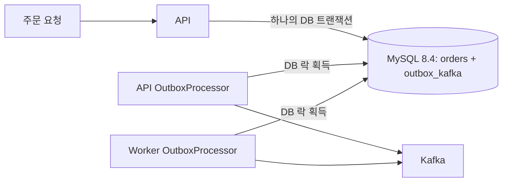

# Transactional Outbox

Spring Boot 4.1.1, Kotlin 2.3.21, JDK 25 LTS 기반 멀티 모듈 예제입니다.
[tomorrow-one/transactional-outbox](https://github.com/tomorrow-one/transactional-outbox)의
로컬 MySQL 지원 버전 `outbox-kafka-spring:4.0.1-SNAPSHOT`을 사용합니다.

## 모듈과 동작

| 모듈 | 역할 | 포트 |
| --- | --- | --- |
| app/api | 주문·Outbox 원자적 저장 및 Kafka 비동기 발행 | 8080 |
| app/worker | 동일 Outbox 감시, 락 인계 및 미발행 메시지 재처리 | 8081 |
| infra/outbox | 공유 DB 설정, Flyway 마이그레이션, 라이브러리 설정 | — |



- API의 `POST /api/orders`는 주문과 이벤트를 **같은 트랜잭션**에 저장합니다.
  응답 201은 DB 커밋을 뜻하며 Kafka 발행 완료를 의미하지 않습니다.
- 두 앱 모두 라이브러리의 `OutboxProcessor`를 실행합니다. DB 락 소유자만
  발행하며 다른 인스턴스는 대기합니다. API를 먼저 시작하면 API가 먼저 락을
  획득할 수 있지만, 라이브러리는 API 우선권이나 자동 원복을 제공하지 않습니다.
- API 종료·장애로 락이 해제되거나 만료되면 Worker가 인계합니다.
  Worker가 먼저 시작하면 Worker가 최초 발행까지 담당합니다.
- Kafka 전송에 실패하면 `processed`가 NULL로 남아 현재 락 소유자가 재시도합니다.
  API의 전송 실패 자체가 Worker 전용 큐로 메시지를 이동시키는 것은 아닙니다.
- 전송 성공 후에만 `processed`가 기록됩니다. DB 기록 전에 프로세스가 종료되면
  중복 발행될 수 있습니다. 소비자는 `x-source` + `x-sequence` 또는 업무 이벤트 ID로
  멱등 처리해야 합니다. 같은 DB를 처리하는 앱은 같은 `OUTBOX_EVENT_SOURCE`를 사용합니다.
- 여기서 재처리는 **Kafka 발행 실패 재시도**입니다. 소비자 업무 실패의 DLT 재처리는 포함하지 않습니다.
- 재시도 횟수 제한과 DLQ는 없으며, 자동 삭제도 비활성화했습니다.
  영구 실패 메시지는 운영 확인이 필요하고, 처리 완료 데이터의 보관·정리 정책은 별도로 정해야 합니다.

## 로컬 실행

먼저 MySQL 지원 라이브러리를 Maven Local에 설치합니다. `commons`도 함께 필요합니다.

```sh
cd /Users/jeoung-gyu/Workspace/opensource/jk-transactional-outbox
./gradlew :commons:publishToMavenLocal :outbox-kafka-spring:publishToMavenLocal
cd /Users/jeoung-gyu/Workspace/outbox-pattern
```

Maven Local 조회는 `one.tomorrow.transactional-outbox` 그룹에만 적용됩니다.
Flyway는 `db/mysql`의 MySQL 전용 스키마를 사용합니다. 기존 PostgreSQL 마이그레이션과
Docker 볼륨은 삭제하지 않으며 기존 데이터의 자동 이전은 수행하지 않습니다.
새 MySQL 볼륨에서 시작합니다. `bootRun`과 테스트 JVM은 UTC로 설정됩니다.

Docker와 JDK 25가 필요합니다. 개발용 MySQL 8.4과 Kafka는 localhost에만 노출됩니다.

```sh
# macOS
export JAVA_HOME=$(/usr/libexec/java_home -v 25)
export PATH="$JAVA_HOME/bin:$PATH"

docker compose up -d
# kafka-init이 성공(exit 0)했고 mysql/kafka가 healthy인지 확인
docker compose ps -a
```

별도 터미널에서 API를 먼저 실행하고 시작 완료 후 Worker를 실행합니다.
Flyway는 두 앱에서 동일한 공유 마이그레이션을 사용하므로 어느 앱을 먼저 시작해도 됩니다.

```sh
./gradlew :app:api:bootRun
./gradlew :app:worker:bootRun
```

```sh
curl -i -X POST http://localhost:8080/api/orders \
  -H 'Content-Type: application/json' \
  -d '{"productName":"Kotlin book","quantity":2}'

curl http://localhost:8080/actuator/health
curl http://localhost:8081/actuator/health

docker compose exec kafka /opt/kafka/bin/kafka-console-consumer.sh \
  --bootstrap-server kafka:19092 --topic orders.created --from-beginning
```

주문·미처리 이벤트·락 소유자는 다음으로 확인합니다.

```sh
docker compose exec mysql mysql -uoutbox -poutbox outbox \
  -e 'select id, topic, `key`, created, processed from outbox_kafka order by id;'
docker compose exec mysql mysql -uoutbox -poutbox outbox \
  -e 'select * from outbox_kafka_lock;'
```

## 장애 인계 확인

1. API를 먼저 실행한 후 Worker를 실행하고 DB 락 소유자를 확인합니다.
2. `docker compose stop kafka`로 Kafka를 중지합니다.
3. 주문을 생성합니다. 요청은 성공하고 이벤트는 DB에 미처리 상태로 남습니다.
4. API를 종료합니다. Worker가 락을 인계합니다.
5. `docker compose start kafka`로 Kafka를 복구합니다.
6. Worker 로그와 `processed` 컬럼으로 발행 완료를 확인합니다.

강제 종료 시에는 락 만료를 기다립니다. 실제 인계 지연에는 락 확인 주기,
진행 중인 전송·DB 트랜잭션 및 Kafka 연결 복구 시간도 포함됩니다.

## 설정

| 환경 변수 | 기본값 | 설명 |
| --- | --- | --- |
| API_PORT / WORKER_PORT | 8080 / 8081 | HTTP 포트 |
| DB_URL | jdbc:mysql://localhost:3306/outbox?connectionTimeZone=UTC&forceConnectionTimeZoneToSession=true | 두 앱이 공유하는 MySQL 8.4 |
| DB_USERNAME / DB_PASSWORD | outbox / outbox | 로컬 개발 DB 계정 |
| KAFKA_BOOTSTRAP_SERVERS | localhost:9092 | Kafka 브로커 |
| ORDERS_TOPIC | orders.created | API가 저장할 이벤트 토픽 (사전 생성 필요) |
| OUTBOX_PROCESSOR_ENABLED | true | 해당 앱의 발행 프로세서 활성화 |
| OUTBOX_PROCESSING_INTERVAL | 200ms | 처리 주기 |
| OUTBOX_LOCK_TIMEOUT | 5s | 락 만료 시간 |
| OUTBOX_EVENT_SOURCE | outbox-pattern | 소비자 중복 제거에 사용하는 공통 소스 |

락 소유자 ID는 인스턴스마다 UUID로 생성합니다. 직접 지정할 경우
`--outbox.lock-owner-id=...`로 인스턴스별 고유한 값을 사용해야 합니다.
Kafka TLS/SASL 등 추가 설정은 `outbox.producer` 맵으로 전달할 수 있습니다.

## 빌드·테스트

```sh
./gradlew clean build
```

테스트는 실행 중인 Docker를 요구하며 Testcontainers로 격리된 MySQL 8.4·Kafka를 만듭니다.
Docker가 없으면 통합 테스트는 실패하며 자동으로 건너뛰지 않습니다.

- API: HTTP 주문 생성과 이벤트 저장, 업무 트랜잭션 롤백, 입력 검증
- Worker: API의 실제 Kafka 발행, Kafka 일시 중단 중 미처리 보존,
  API 종료 후 Worker의 락 인계와 실제 메시지 수신

```sh
java -Duser.timezone=UTC -jar app/api/build/libs/api-0.0.1-SNAPSHOT.jar
java -Duser.timezone=UTC -jar app/worker/build/libs/worker-0.0.1-SNAPSHOT.jar
```

Spring Framework 7 / Boot 4 계열용 라이브러리 4.0.1-SNAPSHOT을 사용합니다.
상위 라이브러리의 호환표는 Boot 4.0.x를 명시하므로 현재 Boot 4.1.1 조합은
프로젝트 통합 테스트로 별도 검증합니다.
